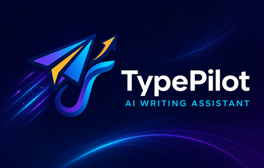

  
  <h1>TypePilot - AI Writing Assistant</h1>
  
  
  
    
  <a href="https://kyriakosgian.github.io/TypePilot/">Website</a> ·
  <a href="https://github.com/KyriakosGian/TypePilot/releases/download/v1.3.0/TypePilot-v1.3.0.zip">Download v1.3.0</a> ·
  <a href="https://github.com/KyriakosGian/TypePilot/releases">Releases</a>

TypePilot is a Chrome extension that helps you write and correct text instantly with Google Gemini Free. Select text in any editable field, then fix spelling and grammar in one click or rewrite, translate, shorten, and adjust the tone.

TypePilot uses your own Google Gemini API key and communicates directly from the browser to Google. There is no TypePilot backend or intermediate proxy.

## What's New in 1.3.0

- Choose the Translate target language in Settings from 25 supported languages.
- The action menu updates dynamically, for example `Translate to German` or `Translate to Greek`.
- Translation results use the selected language in their label and Gemini instruction.
- English remains the automatic default for existing installations.
- Cached results are separated by translation target to prevent language mismatches.

## Writing Actions

| Action | Result |
|---|---|
| Fix | Corrects spelling, grammar, punctuation, and syntax while preserving meaning and language. |
| Rewrite | Improves clarity, flow, and natural phrasing. |
| Translate to selected language | Produces a natural translation in the configured target language while preserving facts and formatting. |
| Shorten | Makes the text more concise without removing essential information. |
| Formal tone | Rewrites the text in a clear, professional tone. |
| Friendly tone | Rewrites the text in a warm, natural tone. |

## Features

- One-click correction with five additional actions in the dropdown.
- Configurable translation target with 25 supported languages and English as the default.
- Structured JSON responses enforced through the Gemini API schema.
- Compatible Gemini model picker, including Gemini 3.1 Flash-Lite and Gemini 3.5 Flash when available.
- Custom writing instructions shared by all actions.
- Personal Dictionary with one protected term per line.
- Result caching, cancellation, and automatic transient-error retry.
- Model, token usage, response time, and cache details in the information panel.
- Support for standard inputs, textareas, contenteditable editors, and Shadow DOM fields.
- Local settings storage and direct browser-to-Google requests.

## Installation

1. Download the latest [TypePilot release](https://github.com/KyriakosGian/TypePilot/releases/latest).
2. Extract the downloaded ZIP file.
3. Open `chrome://extensions/` in Chrome.
4. Enable Developer mode.
5. Select Load unpacked.
6. Choose the extracted TypePilot folder.
7. Pin TypePilot to the Chrome toolbar.

## Configuration

1. Open TypePilot Settings from the toolbar icon.
2. Create a Gemini API key in [Google AI Studio](https://aistudio.google.com/app/apikey).
3. Enter the key in TypePilot.
4. Choose an available Gemini text model.
5. Choose the target language used by the Translate action.
6. Optionally customize the writing instructions and Personal Dictionary.
7. Save the settings.
8. Reload any website tabs that were open before the extension was installed or updated.

Gemini 2.5 Flash-Lite remains the compatibility fallback. Gemini 3.1 Flash-Lite is optimized for speed, while Gemini 3.5 Flash is intended for higher-quality output when those models are available to the API key.

## Usage

1. Select text inside a supported editable field.
2. Click Fix for immediate correction.
3. Open the arrow on the right to choose Rewrite, Translate to your configured language, Shorten, Formal tone, or Friendly tone.
4. Click the returned result to replace the selected text.
5. Open the information icon to view the model, token usage, response time, and cache status.

## Privacy

The API key, selected model, translation language, writing instructions, and Personal Dictionary are stored in `chrome.storage.local`. Access is restricted to trusted extension contexts when supported by Chromium.

The selected text and relevant writing settings are sent directly to Google only when TypePilot makes a Gemini API request. No TypePilot backend or third-party proxy receives them.

Read the full [TypePilot Privacy Policy](PRIVACY.md).

## Credits

- Created by [KyriakosGian](https://github.com/KyriakosGian)
- Website: [kyriakosgian.github.io/TypePilot](https://kyriakosgian.github.io/TypePilot/)
- Supported by [ProCreta.gr](https://procreta.gr)

See [CHANGELOG.md](CHANGELOG.md) for the version history.
