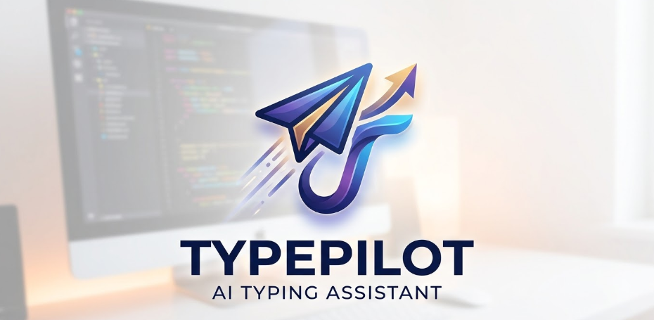
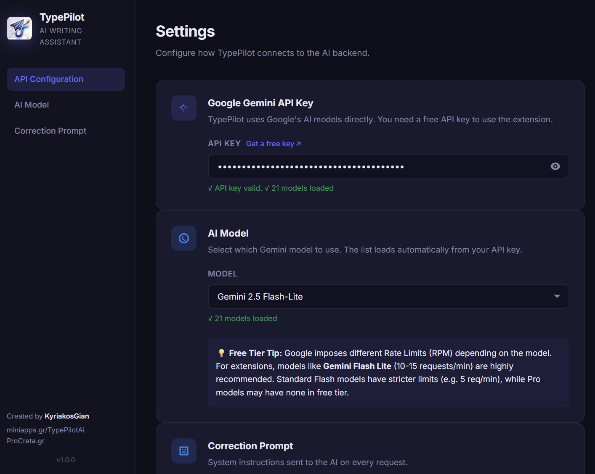
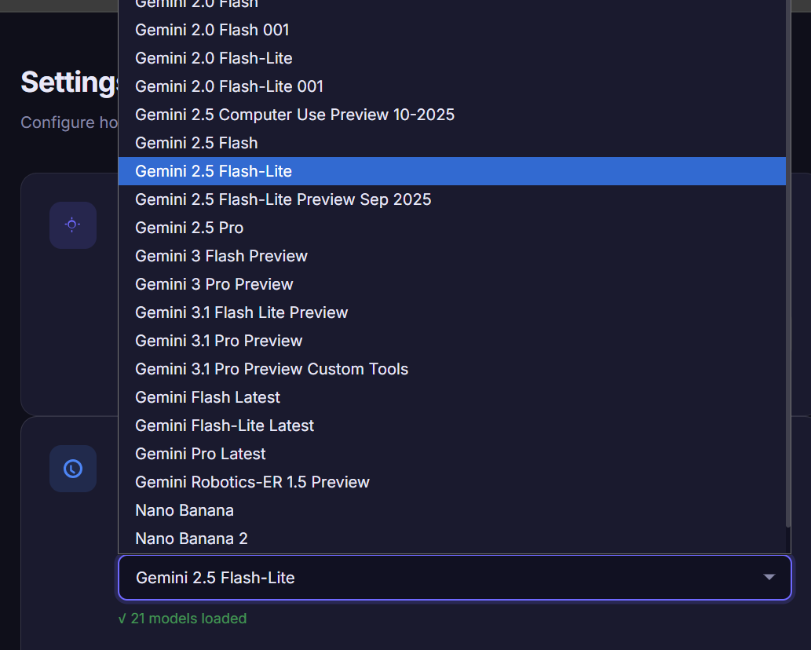
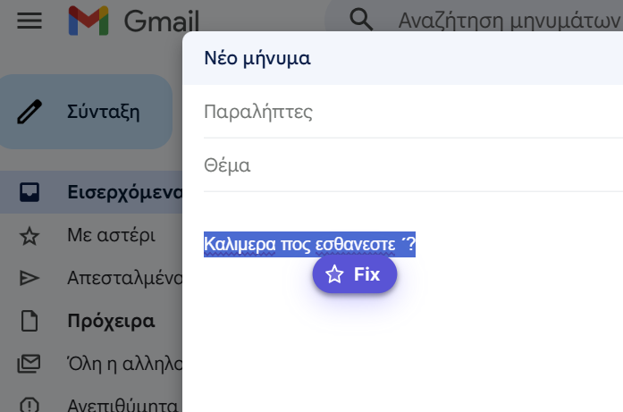
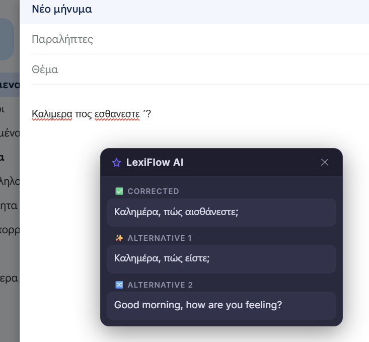
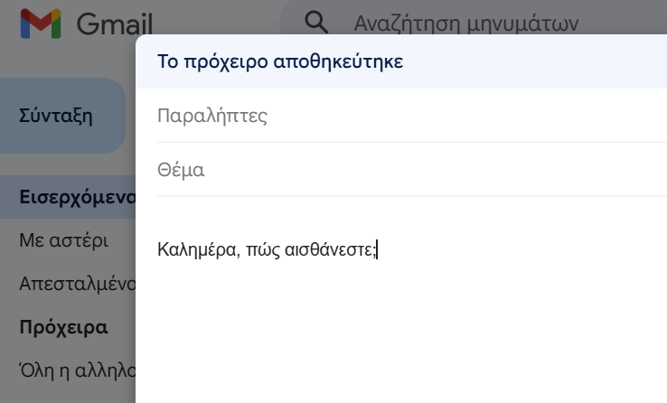

  
  <h1>TypePilot - AI Writing Assistant</h1>

TypePilot is a powerful, lightweight Google Chrome extension that acts as your personal AI writing assistant. Built on top of the **Google Gemini API**, it allows you to instantly correct, rewrite, and elevate your text directly from any browser input field or text area.

## ✨ Features
- **Instant Grammar & Spelling Fixes**: Highlight text anywhere on the web, click the floating popup, and fix your text instantly.
- **Context-Aware Rewrites & Translation**: Provides an alternative variation of your text, and automatically translates your corrected text to English for easy multilingual communication.
- **Bring Your Own Key (BYOK)**: Maximum privacy and security. You use your own free Google Gemini API key. No subscriptions, no hidden proxies.
- **Dynamic Model Selection**: Connects directly to your Google AI Studio account and lets you seamlessly switch between lightning-fast models like **Gemini 2.5 Flash Lite**.
- **Customizable System Prompt**: Tailor how the AI responds and corrects your text by modifying the core prompt inside the extension settings.
- **Beautiful & Fast UI**: A modern Settings panel and a clean, non-intrusive floating popup that integrates naturally with websites.

## 🚀 Installation (Unpacked Extension)
Since this extension is an open-source project, you can easily install it locally on your browser:

1. **Download or Clone** this repository to your computer.
2. Open Google Chrome and go to `chrome://extensions/`.
3. Enable **Developer mode** using the toggle switch in the top right corner.
4. Click the **Load unpacked** button and select the folder containing the extension files.
5. **Pin the extension** to your Chrome toolbar for easy access!

## ⚙️ Configuration

  
  

 

1. Click the TypePilot icon in your Chrome toolbar to open the **Settings** page.
2. Get a free API Key from [Google AI Studio](https://aistudio.google.com/app/apikey).
3. Paste your Gemini API Key in the designated field.
4. Select your preferred **AI Model** (Recommended: *Gemini 2.5 Flash Lite*).
5. Click **Save Settings**.
6. Refresh any open website tabs where you want to use the extension.

## 💡 How to Use
1. Type some text into any input field, text area, or social media composer (e.g. Twitter/X, Facebook, Gmail, etc).
2. **Highlight** the text you want to improve.
3. A small floating **TypePilot popup** will appear.
    
4. Click **Fix** and wait a moment.
5. A dropdown with the corrected text and alternatives will appear. 
    
6. Click your preferred option, and your text will be instantly replaced!
    

## 🔐 Privacy & Security
TypePilot communicates **directly** between your browser and the Google Gemini API. Your API key is stored securely using `chrome.storage.local` within your browser and is **never** sent to any third-party server. All data stays between you and Google.

## 👤 Credits & Links
- Created by **[KyriakosGian](https://github.com/KyriakosGian)**
- Project Page: [miniapps.gr/TypePilotAi](https://miniapps.gr/TypePilotAi)
- Supported by [ProCreta.gr](https://procreta.gr)

---
*If you find this project helpful, consider starring ⭐️ the repository on GitHub!*
